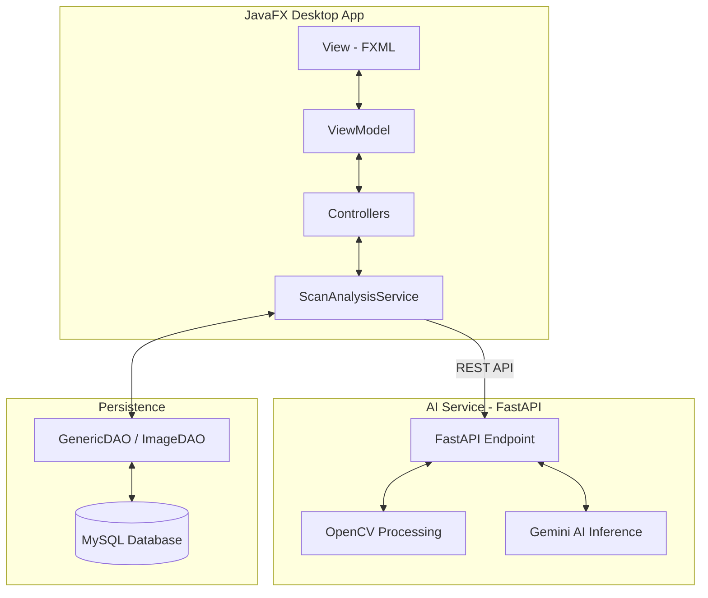
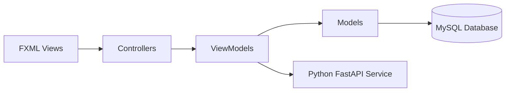

# 🧠 dAIbetes
### AI-Powered Retinal Diagnostic Support System for Early Detection of Diabetic Retinopathy & Glaucoma

<p align="center">
  
</p>

<p align="center">
  
  
  
  
  
</p>

---

## 🚀 Overview

**dAIbetes** is an intelligent medical decision-support system designed to assist healthcare professionals in the early detection of diabetic retinopathy and glaucoma. By combining advanced Digital Image Processing (DIP) with Generative AI (Gemini), the system provides doctors with enhanced visualization and high-accuracy diagnostic predictions.

---

## 🧩 System Architecture

The project utilizes a decoupled **Client-Server architecture**. The JavaFX desktop application manages the medical workflow and data persistence, while a Python FastAPI microservice handles AI inference and image processing tasks.



---

# 🏗️ Design Patterns & Implementation

Based on the system's class diagram, dAIbetes follows strict Object-Oriented Programming (OOP) principles and enterprise design patterns:

- **Decorator Pattern**  
  Used for `ImageFilterDecorator`. This allows doctors to stack image enhancements (e.g., CLAHE, Brightness, Sharpen, Denoise) dynamically without altering the original image class.

- **Factory Pattern**  
  Implemented via `UserFactory`, `DoctorFactory`, and `PatientFactory` to handle secure and abstracted object creation for different user roles.

- **DAO Pattern (Data Access Object)**  
  Centralized data logic using `GenericDAO`, ensuring that controllers interact with data via a standardized interface (`ImageDAO`, `ReportDAO`, `MyPatientsDAO`).

- **MVVM Pattern**  
  Separates the UI (View) from the Business Logic (ViewModel), making the system highly maintainable and testable.

---

# 🧠 UML Class Diagram


---

# 🧱 MVVM Architecture Diagram



---

# ⚙️ Installation & Setup

## 1️⃣ Prerequisites

- Java JDK 17+
- MySQL 8.0+
- Python 3.9+
- Maven

---

# 🐍 Python AI Service Setup (Crucial)

The AI engine runs as a separate microservice. You must configure this environment before running the Java application.

```bash
# 1. Navigate to the Python service directory
cd python-ai-service/python

# 2. Create a virtual environment (venv)
python -m venv venv

# 3. Activate the virtual environment

# Windows
venv\Scripts\activate

# Mac/Linux
source venv/bin/activate

# 4. Install dependencies
pip install -r requirements.txt

# 5. Configure Environment Variables
# Create a .env file and add your Gemini API Key

GEMINI_API_KEY=your_actual_gemini_api_key_here

# 6. Run the FastAPI Server
uvicorn app.main:app --reload
```

---

# 💻 JavaFX Desktop Setup

```bash
# Clone the repository
git clone https://github.com/dalrho/dAIbetes.git

# Setup MySQL
# Import the schema from:
src/main/resources/db/db_schema.sql

# Run the JavaFX application
mvn clean javafx:run
```

---

# 🧠 Core Modules

## 🩺 Doctor Module

- AI Inference Service communicating with FastAPI + Gemini LLM
- Advanced retinal preprocessing using OpenCV
- Dynamic image enhancement using Decorator Pattern
- PDF report generation and patient monitoring
- Human-in-the-loop diagnosis approval system

---

## 👤 Patient Module

- Secure diagnostic history portal
- Consultation and follow-up management
- Simplified AI-generated explanations
- Long-term eye health monitoring

---

# 🏗️ Tech Stack

| Layer | Technology           |
|------|----------------------|
| Frontend | JavaFX (FXML + MVVM) |
| Backend | Java 17+             |
| AI Service | FastAPI              |
| AI Engine | Pytorch + ResNet50   |
| Image Processing | TorchVision          |
| Database | MySQL 8+             |
| Build Tool | Maven                |

---

# 📊 System Goals

- 🧠 Early detection of retinal diseases
- 🤖 AI-assisted medical decision support
- 🔐 Secure patient data handling
- 📈 Scalable enterprise architecture
- 🧑‍⚕️ Human-supervised AI diagnosis

---

# 🌟 Why dAIbetes?

- Reduces diagnostic delays
- Assists overloaded healthcare professionals
- Enhances accuracy using AI + doctor validation
- Designed for real-world clinical workflows
- Modular and scalable enterprise structure

---

# 👥 Development Team

- Angela Jahziel Encabo — Lead Developer
- Harold Shichiya I. Amistad — AI Engineer & Backend Developer
- Gerald Ares — Frontend Developer
- Ycia Debby Magnanao — Backend & Database
- Jhen Aloyon — Backend & Database

---

# 📌 Mission Statement

> “Early detection saves vision.”

dAIbetes is committed to reducing preventable blindness through accessible, high-performance AI-powered medical technology.
