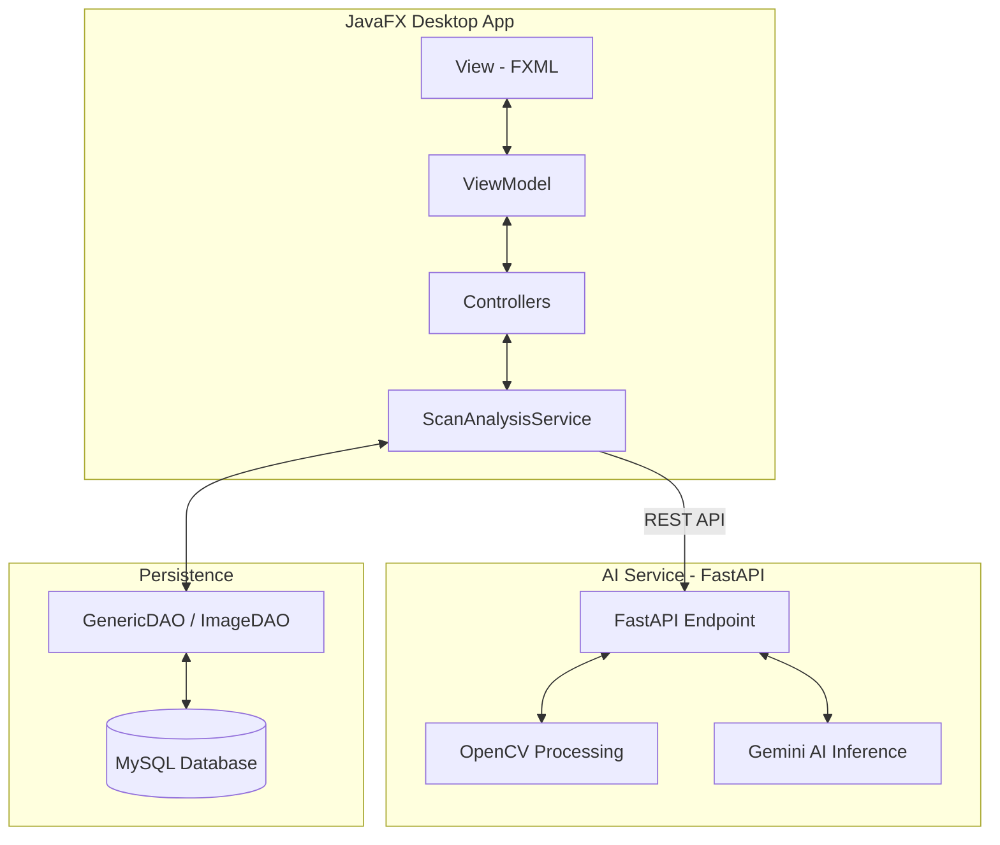
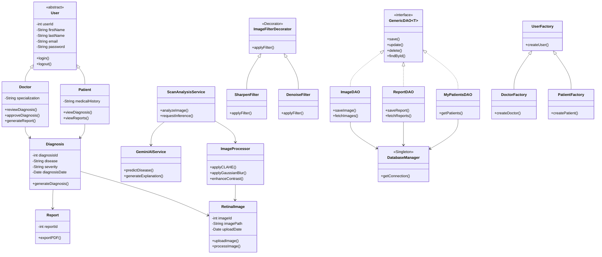
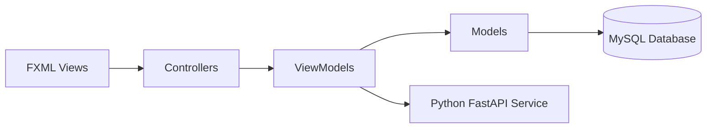

# 👁️ dAIbetes
### AI-Powered Retinal Diagnostic Support System for Early Detection of Diabetic Retinopathy 

---
<p align="center">
  
  
  
  
  
</p>

---

## 📋 Project Overview

**dAIbetes** is an intelligent medical decision-support system designed to assist healthcare professionals in the early detection of diabetic retinopathy and glaucoma. By combining advanced Digital Image Processing (DIP) with Generative AI (Gemini), the system provides doctors with enhanced visualization and high-accuracy diagnostic predictions.

The platform integrates enterprise-level software engineering principles including Object-Oriented Programming (OOP), MVVM architecture, DAO-based persistence, multithreading, and modern design patterns to deliver a scalable, maintainable, and clinically oriented healthcare solution.

---

## 🏗️ System Architecture

The project utilizes a decoupled **Client-Server architecture**. The JavaFX desktop application manages the medical workflow and data persistence, while a Python FastAPI microservice handles AI inference and image processing tasks.



---

## 🛠️ Software Engineering Concepts & Implementation

### 1. Object-Oriented Programming Principles

**How Applied:**
* **Encapsulation:** Enforced through private fields and controlled access methods across entity and service classes.
* **Inheritance:** Utilized through specialized user models such as `Doctor` and `Patient` extending the abstract `User` class.
* **Polymorphism:** Allows different user roles and modules to interact through shared interfaces and abstract behaviors.
* **Abstraction:** Abstract classes and interfaces define reusable structures for services, DAOs, and image-processing modules.

**Importance and Contribution:**
* These OOP principles established a maintainable and scalable architecture for future feature expansion.
* Clear class hierarchies reduced redundancy and improved modularity across the system.

### 2. Java Generics

**How Applied:**
* Generic collections such as `List<T>` and `Map<K,V>` are used for managing appointments, patient records, diagnostic results, and reports.
* Generic DAO interfaces (`GenericDAO<T>`) provide reusable CRUD functionality for multiple entities.

**Importance and Contribution:**
* Generics improved type safety and reduced unnecessary type casting.
* This approach enhanced code reusability and simplified maintenance across the persistence layer.

### 3. Multithreading and Concurrency

**How Applied:**
* Background threads are used for splash screen initialization, API communication, image processing, and asynchronous database operations.
* Synchronization mechanisms are implemented to safely manage concurrent access to shared resources.

**Importance and Contribution:**
* Multithreading ensures that the JavaFX interface remains responsive during intensive processing tasks.
* Concurrency handling improves application reliability and prevents race conditions during simultaneous operations.

### 4. Graphical User Interface (GUI)

**How Applied:**
* The system uses JavaFX with FXML and custom CSS styling to build an interactive medical desktop application.
* Event-driven programming is implemented through handlers and listeners for user interactions such as uploads, calendar selection, and diagnosis review.
* Navigation includes sidebars, modal dialogs, and responsive dashboard layouts for efficient workflow management.

**Importance and Contribution:**
* JavaFX enabled the development of a modern and responsive user experience suitable for healthcare environments.
* Event-driven interaction improved usability and operational efficiency for medical professionals.

### 5. Database Connectivity

**How Applied:**
* JDBC is used to establish secure communication with the MySQL database.
* CRUD operations are implemented through DAO classes for managing users, retinal scans, reports, and diagnosis records.
* Security measures include password hashing, input validation, and controlled database access.

**Importance and Contribution:**
* Persistent storage ensures reliable management of patient and diagnostic information.
* Proper database design and security practices protect sensitive healthcare data and maintain system integrity.

### 6. Unified Modeling Language (UML)

**How Applied:**
* UML Class Diagrams and Use Case Diagrams were created to represent system structure and user interactions.
* The diagrams align closely with the implemented architecture and software modules.

**Importance and Contribution:**
* UML diagrams served as a development blueprint throughout the project lifecycle.
* They improved communication, reduced implementation inconsistencies, and maintained architectural clarity.

### 7. Design Patterns

**How Applied:**
* **Factory Pattern:** Implemented through `UserFactory`, `DoctorFactory`, and `PatientFactory` to centralize user object creation.
* **Decorator Pattern:** Applied through `ImageFilterDecorator` and specialized filters such as brightness enhancement and denoising.
* **Singleton Pattern:** Used in `DatabaseManager` to maintain a single controlled database connection instance.
* **DAO Pattern:** Abstracts database operations and separates persistence logic from business logic.
* **MVVM Pattern:** Separates presentation logic from UI components for maintainability and testing.
* **Observer Pattern:** Utilized for event-driven updates and notification handling between UI components and services.

**Importance and Contribution:**
* These patterns improved modularity, maintainability, scalability, and separation of concerns throughout the application.
* The architecture supports future extensibility while minimizing tightly coupled dependencies.

### 8. Code Quality and Documentation

**How Applied:**
* Classes follow standardized Java naming conventions and are organized into logical packages.
* Javadoc comments and inline documentation explain key modules, methods, and workflows.
* The project follows clean coding practices with readable and modular implementation.

**Importance and Contribution:**
* Consistent code quality improved readability, debugging efficiency, and maintainability.
* Documentation supports easier collaboration, evaluation, and future system enhancement.

---

## 🧩 Design Patterns & Implementation Detail

Based on the system's class diagram, dAIbetes follows strict Object-Oriented Programming (OOP) principles and enterprise design patterns:

*   **Decorator Pattern:** Used for `ImageFilterDecorator`. This allows doctors to stack image enhancements (e.g., CLAHE, Brightness, Sharpen, Denoise) dynamically without altering the original image class.
*   **Factory Pattern:** Implemented via `UserFactory`, `DoctorFactory`, and `PatientFactory` to handle secure and abstracted object creation for different user roles.
*   **DAO Pattern (Data Access Object):** Centralized data logic using `GenericDAO`, ensuring that controllers interact with data via a standardized interface (`ImageDAO`, `ReportDAO`, `MyPatientsDAO`).
*   **MVVM Pattern:** Separates the UI (View) from the Business Logic (ViewModel), making the system highly maintainable and testable.
*   **Singleton Pattern:** Ensures a single managed database connection instance throughout the application lifecycle.
*   **Observer Pattern:** Enables efficient event-driven communication between UI components and backend services.

---

## 📊 UML Class Diagram



---

## 📐 MVVM Architecture Diagram



---

## ⚙️ Installation & Setup

### 1. Prerequisites
* Java JDK 17+
* MySQL 8.0+
* Python 3.9+
* Maven

### 2. Python AI Service Setup
The AI engine runs as a separate microservice. Configure this environment before running the Java application.

```bash
# 1. Navigate to the Python service directory
cd python-ai-service/python

# 2. Create a virtual environment
python -m venv venv

# 3. Activate the virtual environment
# Windows
venv\Scripts\activate
# Mac/Linux
source venv/bin/activate

# 4. Install dependencies
pip install -r requirements.txt

# 5. Configure Environment Variables
# Create a .env file or export the key
GEMINI_API_KEY=your_actual_gemini_api_key_here

# 6. Run the FastAPI Server
uvicorn app.main:app --reload
```

### 3. JavaFX Desktop Setup
```bash
# Clone the repository
git clone https://github.com/dalrho/dAIbetes.git

# Setup MySQL
# Import the schema from: src/main/resources/db/db_schema.sql

# Run the JavaFX application
mvn clean javafx:run
```

---

## 📦 Core Modules

### Doctor Module
* AI inference service integrated with FastAPI and Gemini AI.
* Advanced retinal image preprocessing using OpenCV.
* Dynamic image enhancement through the Decorator Pattern.
* PDF report generation and patient monitoring.
* Human-in-the-loop diagnosis approval workflow.

### Patient Module
* Secure diagnostic history management.
* Consultation and follow-up support.
* Simplified AI-generated explanations.
* Long-term eye health monitoring.

---

## 💻 Technology Stack

| Layer            | Technology           |
| ---------------- | -------------------- |
| **Frontend**     | JavaFX (FXML + MVVM) |
| **Backend**      | Java 17+             |
| **AI Service**   | FastAPI              |
| **AI Engine**    | PyTorch + ResNet50   |
| **Processing**   | TorchVision + OpenCV |
| **Database**     | MySQL 8+             |
| **Build Tool**   | Maven                |

---

## 🎯 System Objectives

* Early detection of retinal diseases.
* AI-assisted medical decision support.
* Secure patient data management.
* Scalable enterprise-level architecture.
* Human-supervised AI diagnosis workflow.

---

## 💎 Value Proposition

* **Reduces Diagnostic Delays:** Rapid AI inference provides immediate preliminary results.
* **Clinical Decision Support:** Assists healthcare professionals with data-driven analysis.
* **Enhanced Accuracy:** Combines automated AI insight with essential doctor validation.
* **Professional Workflow:** Designed specifically for real-world clinical environments.
* **Enterprise Ready:** Modular, scalable, and maintainable architecture.

---

## 👥 Development Team

* **Angela Jahziel Encabo** — Lead Developer
* **Harold Shichiya I. Amistad** — AI Engineer & Backend Developer
* **Gerald Ares** — Frontend Developer
* **Ycia Debby Magnanao** — Backend & Database
* **Jhen Aloyon** — Backend & Database

---

## 🏳️ Mission Statement

> "Early detection saves vision."

dAIbetes is committed to reducing preventable blindness through accessible, high-performance AI-powered medical technology.
